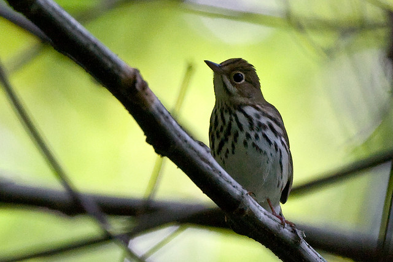
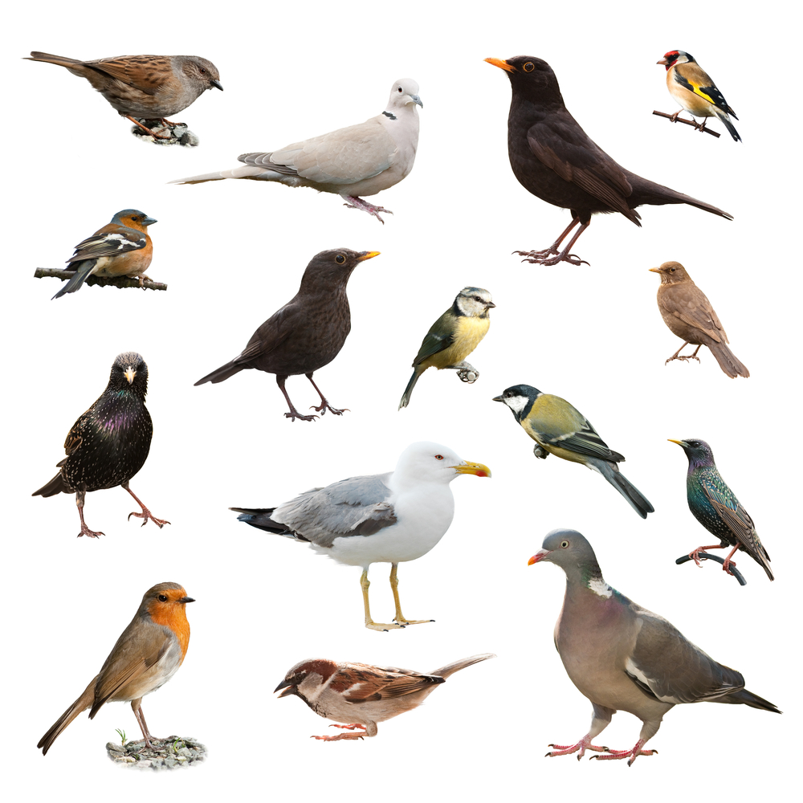
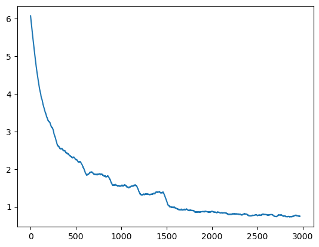
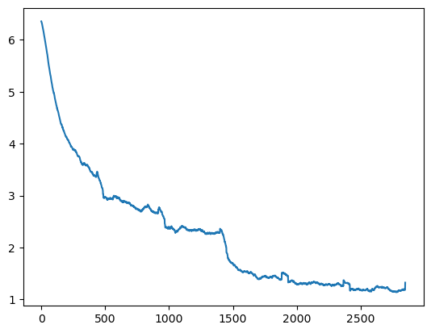
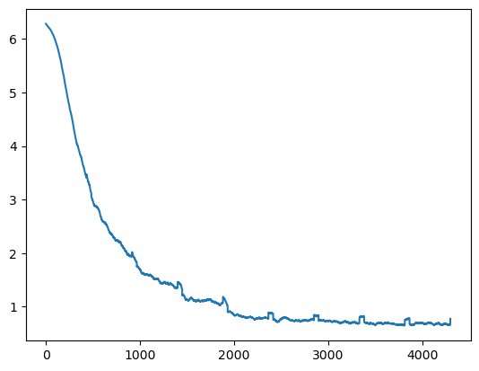

# CSE455-bird-classifier
Final project for CSE 455: Computer Vision (Kaggle bird classification challenge)

## Video
🔗 [Project video (Needs CSE Google login)](https://drive.google.com/file/d/1Qd2GzlDi2T2UaepfCy6Xvw5CCN5MMzMr/view?usp=sharing)



## Introduction
I have never participated in a Kaggle competition before so this was my first exposure to this type of events. While I encountered many problems during the process as a beginner, it was a really good learning experience. I will probably participate in more Kaggle compeitions in the future in my free time! This README file will serve as my website for documenting my final project.

## Problem Description
The Kaggle competition is a bird image classification challenge for students in CSE 455. Each image within the dataset is an image of one of the 555 bird species, and the goal is to train a model that can classify the bird images correctly. There are no limits on how the model is trained, but the final solution should correctly classify the test set of 10,000 images with performance being measured as $$\text{Accuracy} = \frac{\text{No. of correct classifications}}{\text{total number of images}} \times 100\%$$

Labels are not provided for the test set to prevent participants from training (and possibly overfitting) their models on the test set.

## Datasets
I decided to stick with the supplied training dataset for building my model, because it is difficult to find another dataset with the same 555 species of bird expected by this competition. The supplied dataset contains approximately 48,600 images of 555 species of birds in JPEG format at various sizes. The dataset is split into 2 parts: training and test. The training set contains about 38.600 images with labels. No labels are provided for the test set of 10,000 images as it is used to measure the accuracy of models submitted by participants. Birds are not guaranteed to be centered within the image frame, and parts of their bodies may be ocluded by other objects.

My experience is that the supplied dataset is sufficient for training a model with good accuracy, and adding more data will likely slowdown the training process significantly.

## Previous work
Since I have never done a Kaggle competition beofre, I started by taking a look at the tutorial on [Tranfer Learning to Birds](https://colab.research.google.com/drive/1kHo8VT-onDxbtS3FM77VImG35h_K_Lav?usp=sharing) available on the [course website](https://courses.cs.washington.edu/courses/cse455/23sp/) & [ImageNet and Transfer Learning](https://colab.research.google.com/drive/1EBz4feoaUvz-o_yeMI27LEQBkvrXNc_4?usp=sharing). I used these resource as a starting point of my project. I modified the dataload and image augmentation code to .

I also took advantage of many of the pretrained computer vision models available on PyTorch hub. I experimented with [ResNet50, ResNet34](https://pytorch.org/hub/pytorch_vision_resnet/), and [EfficientNet](https://pytorch.org/hub/nvidia_deeplearningexamples_efficientnet/).

I referenced the documentation for different image transformation functions from [PyTorch website](https://pytorch.org/vision/stable/transforms.html). I left comments in my code with link to debugging resources I used (e.g., StackOverflow).

## My Approach
I started by adapting the Transfer Learning on Birds tutorial mentioned above by modifying the fully connected layer to have 555 outputs in order to match the number of bird species in this dataset. I made the mistake of trying to increase the complexity of the fully connected layer by adding a hidden layer which results in a sequence of (Linear, ReLU, Linear) before trying to perform hyperparameter tunning. My thought was to have some nonlinearity in the layer for better results. This change caused me to run out of memory on my GPU and forced me to freeze the first few layers of ResNet for it to start training at all. I did not get very good training accuracy as my training loss would not go below 1.5.

This all happened before I realized the given test set does not have proper labels because it is used for measuring the accuracy of the model across all participants. I was very confused by the extremely poor accuracy of my model on the test set and thought my model was overfitting. You can see this in `classifier_v0_resnet.ipynb` file where the printed test accuracy was below 0.1%. I thought the model had some extreme overfitting since I increase the fully connected layer complexity, so I tried to increase the decay value but it did not work.

Out of frustration after several failed attempts, I decided to revert these changes and stick to using a single linear transformation for the fully connected layer. I also read an Ed post and finally realized the mistake with test set mentioned above. So I went back and changed the code to split my training set with 80% for training and 20% for validation. This finally allows me to have my own validation set to measure my model's performance on images it has not seen before.

```python
    # Data Loader for train, validation, and test
    # Load all data
    fullset = torchvision.datasets.ImageFolder(root=training_dir, transform=transform_train)
    fullsetloader = torch.utils.data.DataLoader(fullset, batch_size=64, shuffle=True, num_workers=2)
    
    # Reserve some images in training directory for testing
    # https://stackoverflow.com/a/51768651
    train_size = int(0.8 * len(fullset))  # 80% for training
    test_size = len(fullset) - train_size  # Remaining 20% for testing
    
    trainset, testset = torch.utils.data.random_split(fullset, [train_size, test_size])
    
    trainloader = torch.utils.data.DataLoader(trainset, batch_size=64, shuffle=True, num_workers=2)
    testloader = torch.utils.data.DataLoader(testset, batch_size=1, shuffle=False, num_workers=2)
    
    # Load actual test data
    actual_testset = torchvision.datasets.ImageFolder(root=test_dir, transform=transform_test)
    actual_testloader = torch.utils.data.DataLoader(actual_testset, batch_size=1, shuffle=False, num_workers=2)
```


I then proceeded to tune the learning rate & scheduled it to decay after 5 epochs. Since I was concerned about the 'overfitting' issue from before, I increased the weight decay to 0.0005. I also reduced the batch size a bit since I got a message about running out of memory earlier. I still used the same ResNet34 pretrained model as the tutorial. The following parameters were used to train the model:

| Parameter | Value |
| --------- | ----- |
| Learning rate | 0.01 for epochs 0-4, 0.001 for epochs 5-9 |
| Weight decay | 0.0005 |
| Momentum | 0.9 |
| Batch size | 64 |
| Epochs | 15 (Only ran 5 epochs due to overfitting) |
| Optimizer | SGD |

After training for 5 epochs, I saw my model was achieving training accuracy of approximately 80% so I decided to make my first subsmission to Kaggle which achieved a testing accuracy of about 69%. I was surprised to see it working as well as it did since this was my first entry to a Kaggle competition.


I then tried to tune my model by changing the hyperparameters. I trid to make it to slow down learning rate at an earlier epoch but the impact was very small. I also switched to ResNet50 for the supposedly improve accuracy on ImageNet. This made training slower and I I then tried to add some image augmentation such as distrotion, color jittering, and random erasure on top of the random horizontal flip that was in my base code. However, I encountered some issues while training my model, and I struggled to get the training loss below 1.

I decided to take at look at the sample images after augmentation, and realized my augmentation was too aggressive. Speicifcally, my random erasure was allowed to ersure up to 20% of the entire image. Since the bird might be relatively small in some images, this erasure could be cuasing problems for my model. I end up removing the random erasure. I also reduced the intensity of jitter and perspective distrotion to get the following image augmentation code:
```python
transform_train = transforms.Compose([
    transforms.Resize(128),
    transforms.RandomCrop(128, padding=8, padding_mode='edge'), # Take 128x128 crops from padded images
    transforms.RandomHorizontalFlip(),    # 50% of time flip image along y-axis
    transforms.RandomPerspective(distortion_scale=0.1, p=0.2),
    transforms.ColorJitter(brightness=.1, contrast=.1, saturation=.1, hue=.1),
    transforms.ToTensor(),
])
```

I did some hyper parameter tuning, but the results were not as good as the my first submission. I was also close to running out of free GPU time so I decided to look elsewhrere for improvement. The settings I used for this model are shown below. It achieved a training accuracy of 71.5% and a validation accuracy of 53.8% after 6 epochs where the training loss starts to plateau. I did not submit this model (`classifier_v0_resnet.ipynb`) to Kaggle since the validation accuracy was lower than my first submission.

| Parameter | Value |
| --------- | ----- |
| Learning rate | 0.01 for epochs 0-2, 0.001 for epochs 3-4 | 0.0001 for epochs 5
| Weight decay | 0.0005 |
| Momentum | 0.9 |
| Batch size | 64 |
| Epochs | 6 |
| Optimizer | SGD |


Finally, I looked around on PyTorch hub to see if I could use another pretrained model besides ResNet as the starting point. I end up choosing EfficientNet which claims to have several advantages over ResNet. I used all of my remaining GPU time on training this model using EfficientNet b0. I inherited the image augmentation code from my second attempt. I decided to increase the image dimension after resizing from 128 x 128 to 256 x 256. My rationale is some birds are quite small within an image, and increasing the input resolution might help the model to capture important details of the bird.
```python
# Load pretrained EfficientNet model
efficientnet = torch.hub.load('NVIDIA/DeepLearningExamples:torchhub', 'nvidia_efficientnet_b0', pretrained=True)

# Number of feature going into the fully connected layer
fc_ins = efficientnet.classifier.fc.in_features

# Replace & reinitialize the fully connected layer with a new  
# one that has matching output for the number of bird classes
efficientnet.classifier.fc = nn.Linear(in_features=fc_ins, out_features =555, bias=True)
```

```python
# Updated image augementation
transform_train = transforms.Compose([
    transforms.Resize(256),
    transforms.RandomCrop(256, padding=8, padding_mode='edge'), # Take 256x256 crops from padded images
    transforms.RandomHorizontalFlip(),    # 50% of time flip image along y-axis
    transforms.RandomPerspective(distortion_scale=0.1, p=0.2), # Add perspective distortion
    transforms.ColorJitter(brightness=.1, contrast=.1, saturation=.1, hue=.1),  # Add color jitter to help mitigate overfitting
    transforms.ToTensor(),
])
```
After some tunning to the hyperparameters, I got a training accuracy of 87.2% and a validation accuracy of 73.7%. I submitted this model to Kaggle and was surprised to to see it's public test accuracy was 76% which is higher than my validation accuracy. I used the following parameters for this model:

| Parameter | Value |
| --------- | ----- |
| Learning rate | 0.01 for epochs 0-3, 0.001 for epochs 4-6 | 0.0001 for epochs 7-8
| Weight decay | 0.0005 |
| Momentum | 0.9 |
| Batch size | 64 |
| Epochs | 9 |
| Optimizer | SGD |



## Results

The first iteration of my model `classifier_v0_resnet.ipynb` using ResNet34 achieved a testing accuracy of 69% on the **publicly visible testset**. It has a training loss curve of 



The second iteration of my model `classifier_v1_resnet.ipynb` using ResNet50 achieved an accuracy of 71.5% on my training set and 53.8% on my own **validation set**. It has a training loss curve of 



The first iteration of my model `classifier_v2_resnet.ipynb` using EfficientNet achieved an accuracy of 87.3% on my training set, 73.7% on my own **validation set**, and 76% on the publicly visible testset. It has a training loss curve of 



I also noticed the EfficientNet seems to have similar (if not a bit faster) training speed compared to ResNet50 despite me running it on scaled images that are 4 times larger. I am not sure if this is due the its architecture and/or the fact the model was trained on an Nvidia GPU with tensor cores like the T4 GPU I used with Kaggle.

## Discussion

### Problems Encountered
Being my first Kaggle competition, I encountered a lot of issues during the process. The first problem I encountered was the training/testing dataset problem that I described above. I wasted a lot of time training and changing the parameters of my model because I saw the extremely poor 'testing accuracy' compared to my training accuracy regardless of what I was doing. I did not realize there dataset did not include working labels for images under the 'test' directory until I saw an Ed post with clarification about the dataset.

The second problem (mistake) I made was trying to add more layers to the end of the network before I had figured out the first issue. It increased my training time and prevented me from discovering the first issue earlier. In hindsight, I should have tried to get figure out what configuration was causing the extremely poor 'testing accuracy' before trying to add more layers to the network.

Another challenge was running out of memory when I experimented with adding a more complex fully connected layer. I learned to freeze the first few convolutional layers of the pretrained model, and that resolved my issues.

I also ran into some issue submitting my predictions to Kaggle. I originally tried to submit the entire notebook, but that took a lot of time, and my notebook generated an error before it could finish. I later realized it is easier and more efficientto run prediction in my interactive session and then submit the CSV label file.

The last problem I encountered was managing Kaggle notebook sessions. There were a few times where I would start training on Kaggle and move on to other tasks before returning to my computer and saw the session has been disconnected even though the kernel was still running. I had to stop the previous kernel, start a new interactive session, and reload from the last checkpoint. This not only took a lot of time, but also means I would lose my training history and training losses. If I had more time, I would have wanted to figure out a way to resolve this issue.

### Next steps
- Perform dataset splitting and image augmentation offline ahead of time to improve training speed
- Explore other pretrained models
- Find more data to train my model. This would be quite challenging since I need to fingd images of the same 555 species of birds labeled based on the same criteria
- Train my models for more epochs to see if I can achieve better results. My free GPU time was limited, and a lot of that time was wasted on figuring out the problems mentioned above as opposed to actually training my model.
- Getting other image augmentation techniques like [random erasure](https://arxiv.org/abs/1708.04896) to work. It would help reduce overfitting for my model and improve its generalizability.
- I know there a lot of other Python libraries like Albumentations that can be used for image augmentation. I would like to try them out to see if they can improve my model's performance.
- It would also be interesting to make further modification to the network such as adding a hidden layer or chanigng the convolutional layer to better capture the features of birds (e.g., taking advantage of spacial locality).

### How does my approach differ from others? Was that beneficial?
I used to a number of different pretrained models and experiemented with various image augmentation techniques besides the horizontal flip that was covered in class. While I was unable to all of the augmentation techniques that I have experimented with to work, I think this was still benefitial in keeping my model from overfitting and improving its generalizability.

I also tried to manually tune the hyperparameters of my model to get the best results instead of using a automatic decay scheduler. This help me get a better understanding of the effects of changing the parameters, and allows me to fine tune the learning rate decay down to specific epochs. I think this had some benefits for me as it allows me to save GPU time by stopping the trainnning process earlier when I see the training loss starts to plateau.

I tried changing a lot of things in my approach to this competition such as image augmentation, adding additional layers, hyperparameter tunning, and using different pretrained models. I think this was not the best choice when I had very limited time and GPU resources for the project, though it might be a good thing for longer-term projects. I think I would have benefitted from focusing on fewer areas like changing hyperparameters & image augmentation in the context of this project. That's said, I think it was a good learning experience for me, and I will definitely take these learning into my future projects.
